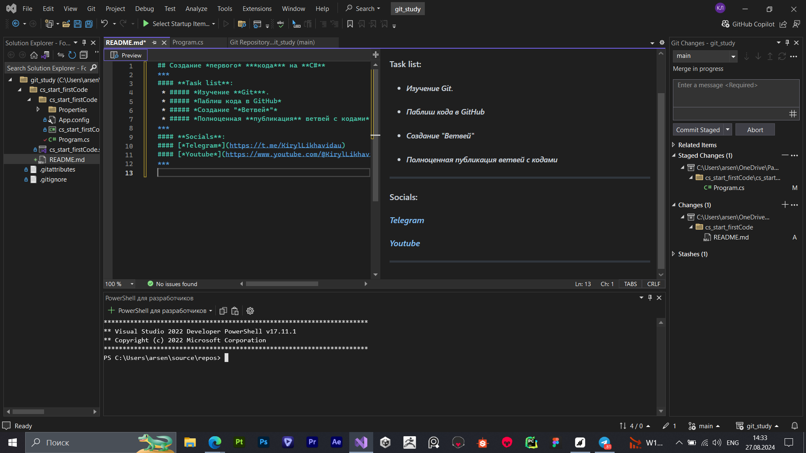

## Creating *the first* ***code*** on **C#**
***
#### **Task list**:
 * ##### *Learning **Git***.
 * ##### *Publish code to GitHub.*
 * ##### *Creating of "*Branches*".*
 * ##### *Full ***publish*** of branches with code.*
***
#### C# *code:*
```
int a = 17;
string b = "age";
float c = 2024f
```
> Coolest README document in my coding! (maybe)
***
#### **Socials**:
#### [*Telegram*](https://t.me/KirylLikhavidau)
#### [*Youtube*](https://www.youtube.com/@KirylLikhavidau)
***
#### My **VS**:)
[](https://github.com/LosPolosKirillos)
***
Nthng| **Happiness** | **Strength** | **Freedom**
:----- |:--------:	  | :------:     | ------:
Amount |10000000      | 50000000     | 100000...
Full/Empty| **OVERFULL**  | **OVERFULL**     | **OVERFULL**
***